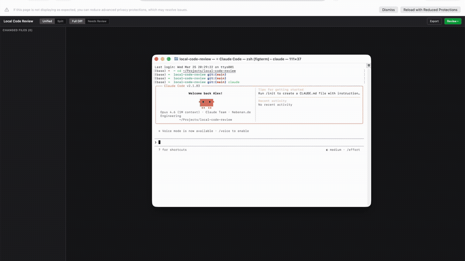

# Local Code Review (lcr)

Local code review tool for AI-assisted development. Review uncommitted changes with a GitHub PR-like interface — inline comments, suggestions, questions — then approve & commit or send feedback to AI for another round.

<p align="center">
  
</p>

## Why?

When developing with AI (vibe-coding), AI makes many changes at once. There's no good way to review those changes and give structured feedback before committing. Diff tools show changes but don't let you write comments. Chat interfaces take one comment at a time. This tool gives you the full PR review experience locally:

- **See diffs** like a GitHub PR (unified or split view, syntax highlighted)
- **Write inline comments** on any line — comments, suggestions, questions
- **Approve individual files** to stage them for commit
- **Toggle between full diff and unstaged-only** to focus on what still needs review
- **Submit a structured review** with all your feedback at once
- **Send to AI** — export review as JSON/Markdown, copy to clipboard, or send directly to Claude Code via built-in terminal
- **Outdated detection** — comments are automatically flagged when the underlying code changes
- **Approve & commit** when you're satisfied

## Install

```sh
npm install -g local-code-review
```

Requires Node.js 18+.

## Quick Start

```sh
cd your-project
lcr
```

Opens a web UI at `http://localhost:5678` showing all uncommitted changes.

## Usage

### Reviewing a project

Run from inside any git repository:

```sh
lcr                    # Review current directory
lcr /path/to/project   # Review a different project
```

### Running multiple instances

Each instance needs its own port:

```sh
lcr                          # First project on default port 5678
PORT=5679 lcr /path/to/other # Second project on port 5679
```

### Review flow

1. Browse changed files in the sidebar
2. Click the `+` button on any line to add a comment
3. Choose comment type: **comment**, **suggestion**, or **question**
4. Add comments across multiple files
5. Approve individual files (checkbox in sidebar) — approved files are staged for git
6. When done, click **Review** and choose:
   - **Request Changes** — sends your review to Claude Code for another iteration
   - **Approve & Commit** — opens commit dialog with approved/all file options

### Diff modes

- **Full Diff** — shows all uncommitted changes (staged + unstaged)
- **Needs Review** — shows only unstaged changes, so you can focus on what hasn't been approved yet

### Export options

Click **Export** in the toolbar:

- **Send to Claude Code** — sends review to Claude via the built-in terminal
- **Copy to Clipboard** — paste into any AI chat
- **Export as JSON** — saves `.lcr-review.json` in the project root
- **Export as Markdown** — saves `.lcr-review.md` in the project root

### Built-in terminal

The tool includes an embedded terminal that runs an interactive Claude session in your project directory. When you click "Request Changes" or "Send to Claude Code", your review is sent directly to this terminal session. Claude can then make changes, and you can review the next round without leaving the tool.

The terminal uses a WebSocket connection on a separate port (main port + 1000 by default).

### Outdated comments

When AI makes changes after you've submitted a review, comments on lines that changed are automatically marked as **Outdated** with a yellow badge. This happens whenever the diff is refreshed, so you can see which of your comments have already been addressed.

### File approval

Click the checkbox next to any file in the sidebar to approve it. Approved files are:
- Staged in git (`git add`)
- Shown with a strikethrough in the sidebar
- Excluded from the "Needs Review" diff mode

If an approved file is modified again, its approval status is reset.

### Keyboard shortcuts

| Key | Action |
|-----|--------|
| `j` / `k` | Navigate files |
| `b` | Toggle sidebar |
| `Cmd/Ctrl+Enter` | Submit comment / commit |
| `Escape` | Cancel comment |

## Configuration

### Environment variables

| Variable | Default | Description |
|----------|---------|-------------|
| `PORT` | `5678` | HTTP server port |
| `LCR_REPO_DIR` | Current directory | Path to the git repository to review |
| `VITE_LCR_WS_PORT` | `PORT + 1000` | WebSocket port for the terminal (dev mode only) |

### Claude Code integration

The "Send to Claude Code" feature requires [Claude Code](https://docs.anthropic.com/en/docs/claude-code) CLI to be installed. The tool uses whatever model your Claude Code is configured with. To change the default model:

```sh
claude config set model claude-sonnet-4-6
# or
claude config set model claude-opus-4-6
```

## Development

### Setup

```sh
git clone <repo>
cd local-code-review
npm install
npm run dev
```

The dev server starts at `http://localhost:5173` by default.

### Testing with another project

Point `LCR_REPO_DIR` at a different git repository:

```sh
LCR_REPO_DIR=/path/to/your/project npm run dev
```

To run multiple dev instances simultaneously, each needs its own port and WebSocket port:

```sh
# Instance 1 (default ports: 5173 + WS on 6173)
LCR_REPO_DIR=/path/to/project-a npm run dev

# Instance 2 (custom ports: 5174 + WS on 6174)
LCR_REPO_DIR=/path/to/project-b VITE_LCR_WS_PORT=6174 npm run dev -- --port 5174
```

### Building

```sh
npm run build
```

Test the production build locally:

```sh
node bin/lcr.js /path/to/project
```

### Project structure

```
src/
  lib/
    components/    # Svelte UI components (DiffView, FileTree, Terminal, etc.)
    server/        # Server-side code (git operations, review store, terminal)
    stores/        # Svelte stores (files, review, UI state)
    types/         # TypeScript interfaces
  routes/
    api/           # REST API endpoints (diff, comments, export, commit, etc.)
    +page.svelte   # Main page
bin/
  lcr.js           # CLI entry point
```

## Notes

- Comments are stored in memory and reset when the server restarts
- The `.lcr-review.json` and `.lcr-review.md` export files are created in the project root — add them to `.gitignore` if needed
- Syntax highlighting is powered by [Shiki](https://shiki.matsu.io/) (same engine as VS Code)
- The terminal feature requires `node-pty` which needs a C++ compiler to build (usually available by default on macOS/Linux)

## License

MIT
